# Guide

Lens is a mountable Phoenix LiveView SQL notebook pointed at the host Ecto Repo. It is the PgHero-shaped tool you mount at `/lens`: ask a question, save it, pin it to a dashboard, and **mask PII/PHI in every output**.

It is not Metabase. There is no sidecar JVM and no god-mode warehouse user. Queries are **view-only**: `SELECT` / `WITH` (optional `EXPLAIN`) only — `DELETE`, `UPDATE`, and `INSERT` are rejected. Field policy runs on the grid, CSV, JSON, embeds, MCP tool results, and the audit log.

This page is a tour of the product as it looks in the dummy app (`dummy/` on [http://localhost:4000/lens](http://localhost:4000/lens)), plus how queries are designed for **PostgreSQL** (default) and **DuckDB** (optional). Agents can drive the same notebook over **MCP** at `/lens/mcp`.

Install and auth: [Phoenix.md](Phoenix.md). MCP server: [MCP.md](MCP.md). Threat model: [Policy.md](Policy.md). Host pipeline as permissions: [Permissions.md](Permissions.md).

This library is **not** HIPAA or GDPR certified. You are the operator.

## Home

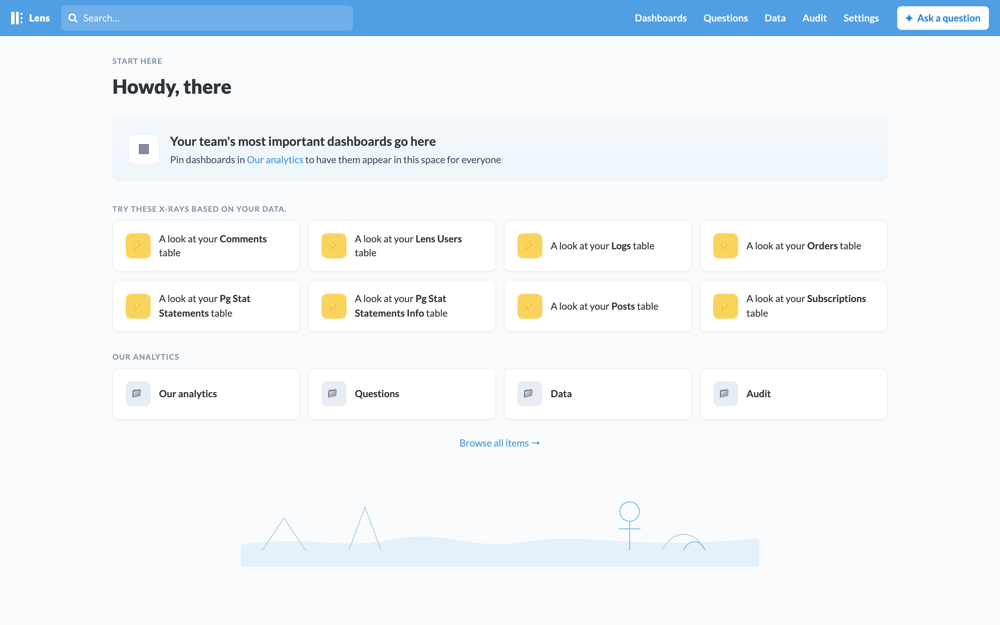

The shell is a top bar: search, Dashboards, Questions, Data, Audit, Settings, and **Ask a question**. Home lists x-rays for discovered tables and any dashboards you pin.

Dummy data is a small SaaS-shaped schema: `users`, `orders`, `posts`, `comments`, `logs`, `subscriptions`. Configured masks in the dummy app:

```elixir
config :phoenix_lens,
  repo: Dummy.Repo,
  masked_fields: [:email, :first_name, :phone, :ip, :author_email]
```

Ecto `redact: true` (for example `Dummy.Accounts.User.email`) is merged in automatically.

## Asking a question

`/lens/ask` has two editors. **Notebook** compiles filters, metrics, and grouping into SQL. **Native query** is a SQL textarea. Both share the same preview pane, the same `PhoenixLens.Query.run/2` path, and the same field policy.

### Notebook

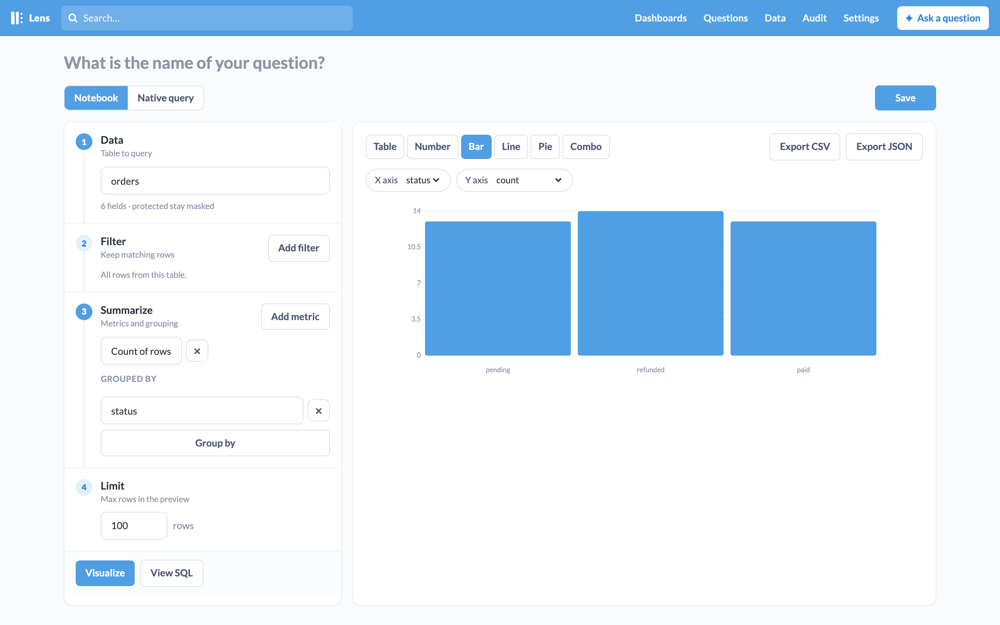

1. **Data** — pick a table. Protected columns stay labelled; picking a table auto-previews `SELECT *`.
2. **Filter** — equals, contains, empty, comparisons. `contains` becomes `ILIKE`.
3. **Summarize** — count / sum / avg / min / max, plus **Group by**.
4. **Limit** — preview cap (hard ceiling is still `max_rows`, default 10_000).

**Visualize** re-runs the compiled SQL. The preview switches Table / Number / Bar / Line / Pie / Combo. Charts coerce Y to a numeric column or **Count of rows**; a masked text column is not a valid Y axis.

**View SQL** shows the generated statement, for example:

```sql
SELECT "status", count(*) AS "count"
FROM "orders"
GROUP BY "status"
LIMIT 100
```

Save stores the SQL (not the notebook AST) on the host Repo.

### Native query

![Native SQL: email aliased as contact is still [redacted]](images/ask-sql.png)

Type SQL, then **Run** or **Ctrl+Enter** (Cmd+Enter on macOS). Autocomplete uses Ecto schemas plus `information_schema` (or DuckDB’s catalog when that engine is on). Type after `FROM` / `JOIN` for tables, `users.` for columns.

The dummy query that shows policy on an alias:

```sql
SELECT id, email AS contact, first_name, last_name
FROM users
ORDER BY id
LIMIT 12
```

`contact` is still `[redacted]`: masking keys off the origin identifier, not only the output name. `first_name` is in `masked_fields`; `last_name` is a runtime global rule from **Column protection**.

## Catalog

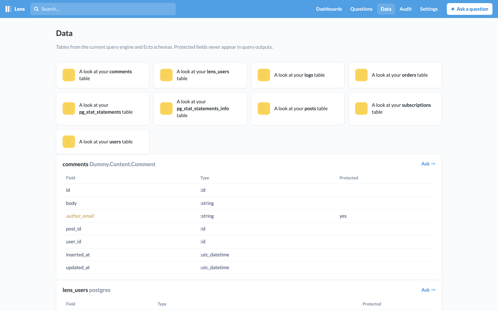

**Data** (`/lens/catalog`) lists tables from the current engine and Ecto schemas. Protected fields are marked and rendered in the protected colour. **Ask →** opens the notebook on that table.

When the engine is DuckDB, the same page is sourced from attached databases (`repo.users` also appears as `users` via host views). Internal DuckDB catalogs may show as `memory`:

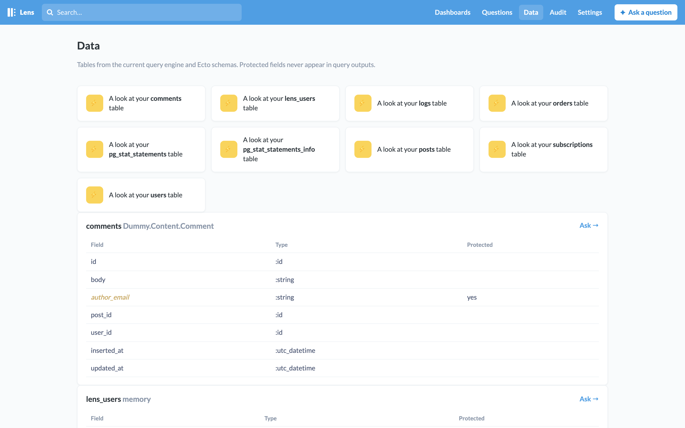

## Questions and dashboards

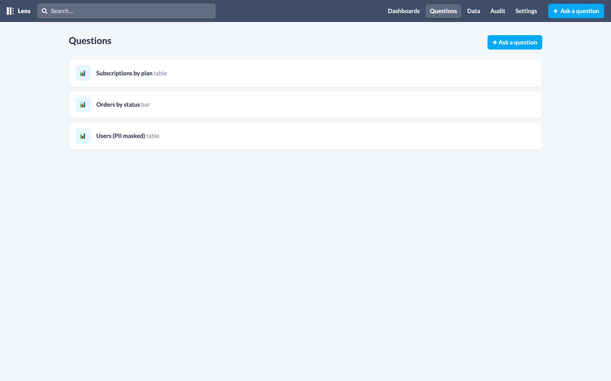

A saved question is a name, SQL, viz, and database id. Opening it re-runs through `Query.run/2`. The editor, **Export** CSV, **Delete**, and **Save** sit in the toolbar. Pin the question onto a dashboard from the same page.

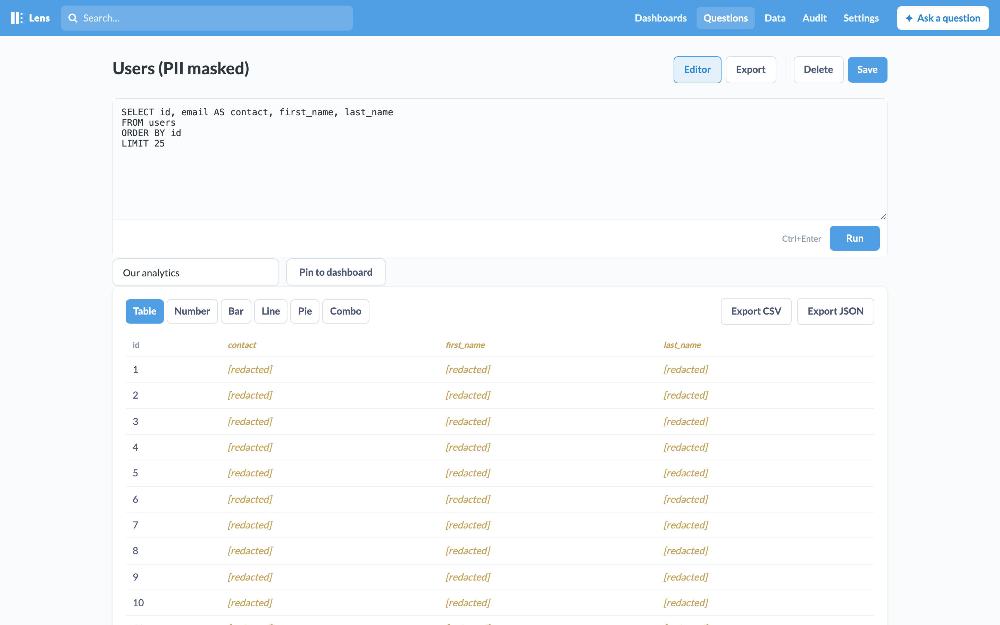

Dashboards are folders of cards. Each card is a saved question. Optional date-range filters wrap the SQL when a date column is set. **Edit** turns on a 12-column board: drag a card to move it, pull the corner to resize, then **Save**. **Cancel** drops unsaved arrangement.

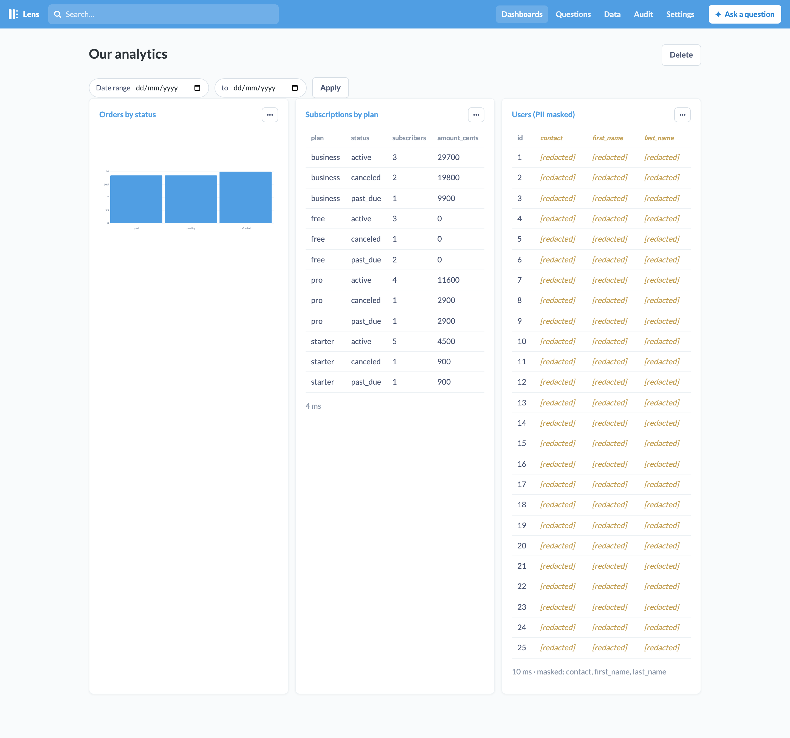

`QuestionCard` embeds the same result (and the same policy) in a host LiveView:

```heex
<.live_component
  module={PhoenixLens.Components.QuestionCard}
  id={"q-#{id}"}
  question_id={id}
  actor={@current_user}
/>
```

## Audit

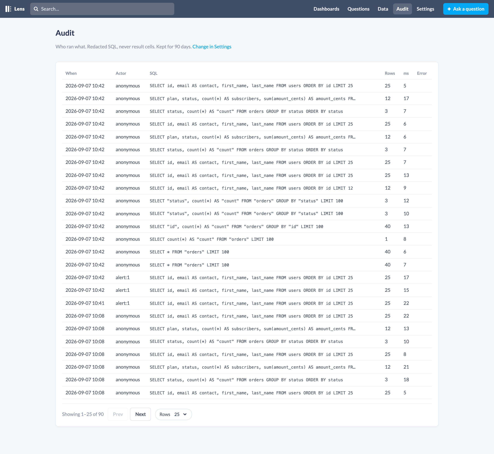

Every run records **who**, **redacted SQL**, row count, duration, and error. Result cells are never stored. Actor is `conn.assigns[:current_user]` (or `actor_assign:`); a struct with `:id` is stored as `user:<id>` — never the email.

Pagination is 25 / 50 / 100. Retention is **Settings → Audit log** (7, 30, 90, 180, 365 days, or forever). Default is 90 days. Expired rows are deleted on record, on the audit page, and when retention is saved.

## Settings

### PostgreSQL vs DuckDB

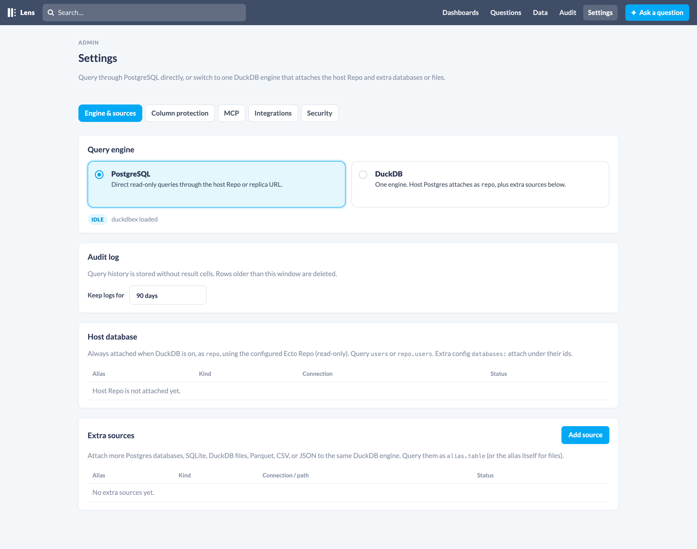

The default engine is **PostgreSQL**: Lens runs your SQL on the host Repo (or a replica URL) inside a read-only transaction.

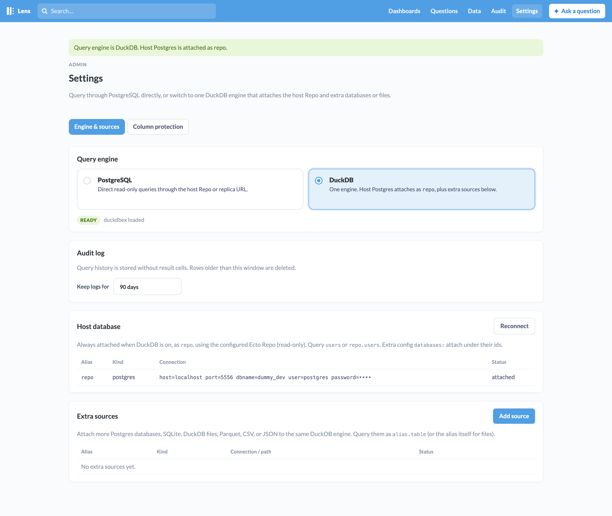

**DuckDB** starts an in-process engine, attaches the host Repo read-only as `repo`, and lets you attach extra sources to that one connection. Questions, dashboards, settings, and audit still live on the host Repo. Field policy still runs on every DuckDB result.

DuckDB is optional. The dummy app already depends on it; a host app must add:

```elixir
{:duckdbex, "~> 0.4"}
```

Without the NIF, Settings still render and switching explains the missing dep.

### Extra sources

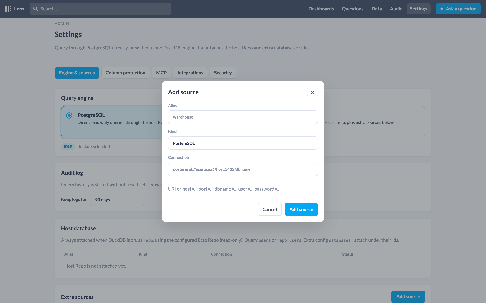

**Add source** is a modal: alias, kind, connection string or path. Kinds: Postgres, MySQL, SQLite, DuckDB file, Parquet, CSV, JSON. File sources become a view named after the alias. Remote HTTP/S3 paths load the `httpfs` extension.

Query extras as `alias.table` (or the alias itself for files). DSNs are redacted in the table (`password=••••`).

### Column protection

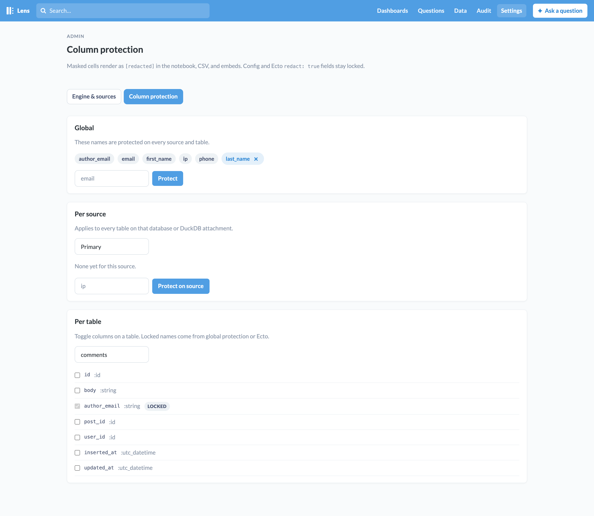

`/lens/settings/protection` adds runtime masks on top of config and Ecto `redact: true`:

| Scope | Effect |
| --- | --- |
| **Global** | Column name is masked on every source and table. Config / `redact: true` names are locked chips. |
| **Per source** | Masked on that database id or DuckDB alias. |
| **Per table** | Masked only when the SQL `FROM` / `JOIN` list includes that table. `users.email` does not mask `subscriptions.email`. |

Locked chips cannot be removed from the UI; change `masked_fields` or the schema instead.

### MCP

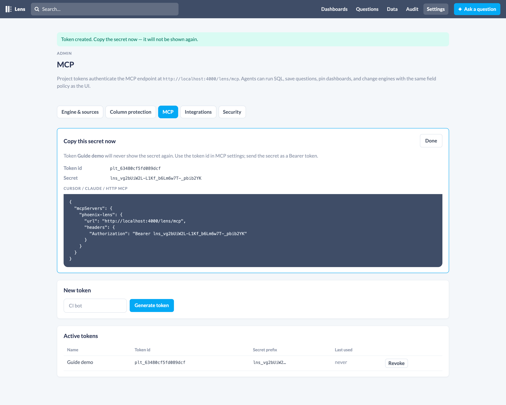

**Settings → MCP** (`/lens/settings/mcp`) issues project tokens for the Streamable HTTP MCP server at `/lens/mcp`. Each token has a public **token id** (`plt_…`) and a **secret** (`lns_…`) shown once. Clients send `Authorization: Bearer <secret>`.

Tools cover the same surfaces as the UI (catalog, SQL, questions, dashboards, audit, engines, sources, column protection). Field policy still masks cells as `[redacted]`. Creating and revoking tokens is UI-only. Setup and the tool list: [MCP.md](MCP.md).

### Integrations and alerts

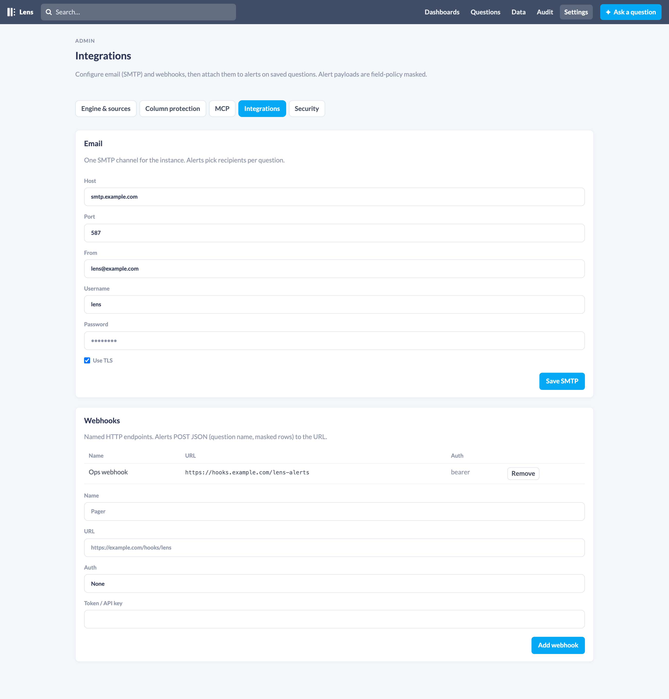

**Settings → Integrations** configures SMTP and named webhooks. On a saved question, **Alert** sends email or a JSON POST when the question returns rows, returns none, or crosses a numeric goal. Masked cells stay `[redacted]`. Details: [Alerts.md](Alerts.md).

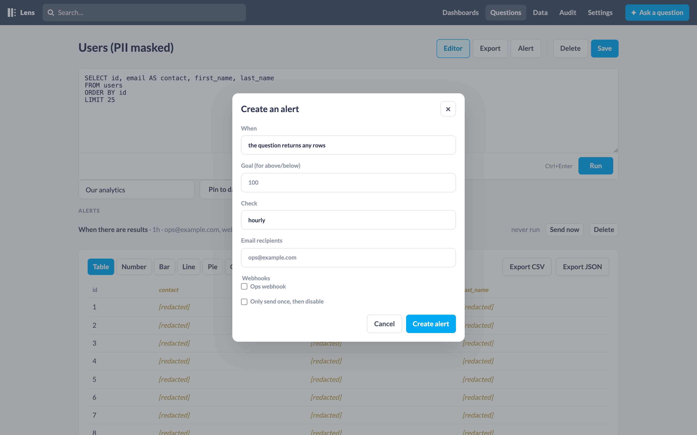

### Security

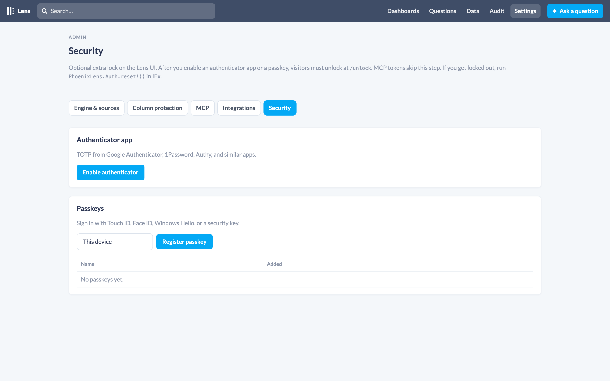

**Settings → Security** (`/lens/settings/security`) is optional. Enable an authenticator app (Google Authenticator, 1Password, Authy, …) and/or register a passkey (Touch ID, Face ID, Windows Hello, security key). After either is on, visitors must unlock at `/lens/unlock` before the notebook. MCP tokens skip this step. Host pipeline auth is still required. Locked out: `PhoenixLens.Auth.reset!()` in IEx.

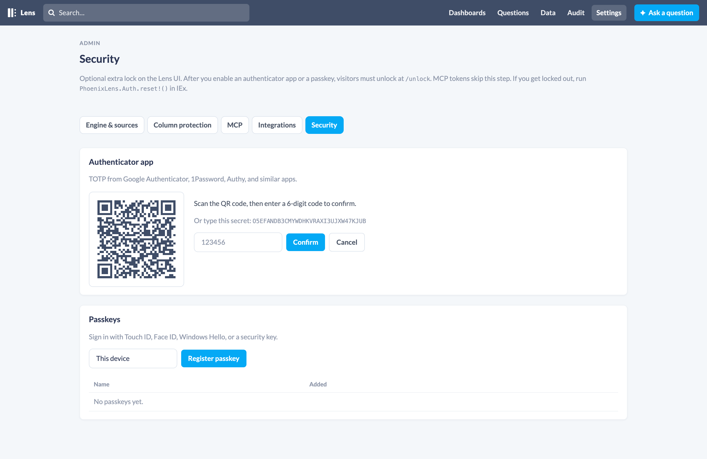

Details: [Phoenix.md](Phoenix.md), [Permissions.md](Permissions.md).

## Query design

Every notebook click and every **Run** lands in `PhoenixLens.Query.run/2`. There is no public unmasked path.

```
  editor / notebook
          │
          ▼
   SQL.validate/1          one statement; SELECT | WITH | EXPLAIN …
          │
          ▼
   Settings.engine()
      ┌───┴────┐
      ▼        ▼
 PostgreSQL   DuckDB.Server
 read-only    ATTACH + SELECT
 timeout      timeout + row cap
      └───┬────┘
          ▼
   Policy.apply/4          origin + output name + computed expr
          ▼
   %Result{}               :redacted cells
          │
          ├── grid / charts
          ├── CSV / JSON export
          ├── QuestionCard embed
          ├── MCP tools/call
          └── Audit.record (SQL redacted, no cells)
```

### What SQL is allowed

`PhoenixLens.SQL.validate/1`:

- Exactly one statement
- First keyword `SELECT` or `WITH`, or `EXPLAIN` of those
- Rejects `INSERT` / `UPDATE` / `DELETE` / `DROP` / `ALTER` / `CREATE` / `COPY` / `ATTACH` / `DETACH` / `INSTALL` / `LOAD` / …

`ATTACH` and `INSTALL` happen only inside the DuckDB engine, never from the editor.

### Notebook → SQL

`PhoenixLens.Notebook` is a small compiler, not a query planner. Identifiers are quoted. Filters AND together. Aggregations without a group-by still emit `count(*)` when you add a metric. The saved artifact is the SQL string.

### Origin-aware masking

`SQL.column_origins/2` walks the SELECT list. A column is masked when:

- the output name is protected (`SELECT email`)
- the origin identifier is protected (`SELECT email AS contact`)
- the SELECT item is a computed expression that mentions a protected identifier (`first_name || last_name`)

Table-scoped rules use `SQL.table_refs/1` (`FROM` / `JOIN`, including `repo.users`). Double-quoted identifiers are kept; only single-quoted string literals are stripped before the scan.

### Result shape

`%PhoenixLens.Result{}` columns stay the SQL names; masked cells are the atom `:redacted`, rendered `[redacted]`. `masked_columns` is listed under the grid (see the Users card on the dashboard screenshot). Do not log result rows.

## PostgreSQL engine

Default. `Query` opens a transaction on the configured Repo (or a `Postgrex` connection for `databases:` URLs) and sets:

```sql
SET LOCAL transaction_read_only = on
SET LOCAL statement_timeout = 5000   -- timeout_ms, default 5s
```

Then it runs the user SQL with `log: false`, truncates to `max_rows` (default 10_000), applies policy, and audits.

Prefer a **read replica** for the query target. Metadata (questions, dashboards, settings, audit, protection rules) always uses `config :phoenix_lens, repo:`.

```elixir
config :phoenix_lens,
  repo: MyApp.Repo,
  timeout_ms: 5_000,
  max_rows: 10_000,
  databases: [
    primary: [repo: MyApp.Repo],
    analytics: [url: System.get_env("ANALYTICS_DATABASE_URL"), name: "Analytics"]
  ]
```

A replica role that can `SELECT` but not write application tables complements masking; it does not replace it. Aliases still have to be masked in the UI.

Postgres-first is the right default: no NIF, no extension download, one less failure mode for the notebook you actually mount in production. See [ADR-004](004-duckdb-engine.md).

## DuckDB engine

Use DuckDB when one question needs to join the host Repo with another Postgres, MySQL, SQLite, Parquet, CSV, or JSON without standing up another BI box.

On switch (Settings, or `PhoenixLens.Settings.put_engine("duckdb")`):

1. An in-memory DuckDB starts
2. Extensions load as needed: `postgres`, `mysql`, `sqlite`, `json`, `httpfs`
3. Host Repo attaches `READ_ONLY` as `repo`
4. Host public/main tables are also aliased as views, so `users` and `repo.users` both work
5. Extra sources `ATTACH` (or `read_csv_auto` / `read_parquet` / `read_json_auto` as views)

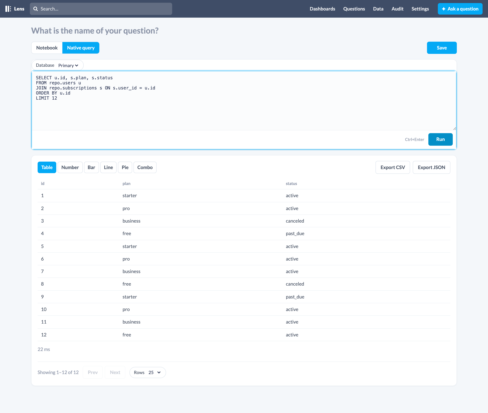

```sql
SELECT u.id, s.plan, s.status
FROM repo.users u
JOIN repo.subscriptions s ON s.user_id = u.id
ORDER BY u.id
LIMIT 12
```

Across extra sources the same idea holds:

```sql
SELECT u.id, b.sku, p.plan
FROM repo.users u
JOIN billing.orders b ON b.user_id = u.id
JOIN plans p ON p.user_id = u.id
```

`plans` here would be a CSV/Parquet view (the dummy app ships `dummy/priv/sample_plans.csv` you can attach as kind `csv`, alias `plans`).

Config-only extras, if you do not want them in the Settings UI:

```elixir
config :phoenix_lens,
  engine: :duckdb,
  duckdb_sources: [
    %{alias: "billing", kind: "postgres", dsn: System.get_env("BILLING_DATABASE_URL")},
    %{alias: "plans", kind: "csv", dsn: "priv/sample_plans.csv"}
  ]
```

User SQL still cannot `ATTACH`. Timeouts and row caps still apply. Origin-column masking uses the SELECT list (DuckDB has no Postgres `RowDescription` OIDs).

## Dummy app

```sh
cd dummy
docker compose up -d
mix setup
mix phx.server
```

Postgres is on host port **5556** (`dummy_dev`). Open [http://localhost:4000/lens](http://localhost:4000/lens) and run the native query above: `contact` / `first_name` / `last_name` render as `[redacted]`. Switch the engine in Settings to try DuckDB against the same tables.

The dummy app depends on `{:phoenix_lens, path: ".."}` and `{:duckdbex, "~> 0.4"}`. After beam, CSS, or JS changes, restart `mix phx.server` so `/lens/assets` is not an old build.

## MCP

The dummy app already mounts `PhoenixLensWeb.Plugs.MCP` at `/lens/mcp`. Generate a token in Settings, then point an MCP client at that URL.

```json
{
  "mcpServers": {
    "phoenix-lens": {
      "url": "http://localhost:4000/lens/mcp",
      "headers": {
        "Authorization": "Bearer lns_…"
      }
    }
  }
}
```

`run_sql` is still SELECT/WITH only. Audit actor is `mcp:<token_id>`. Host mount and the full tool list: [MCP.md](MCP.md).

## Related

- [Phoenix.md](Phoenix.md) — install, mount, auth, multi-db, embed
- [MCP.md](MCP.md) — MCP server, project tokens, tools
- [Alerts.md](Alerts.md) — email and webhook alerts
- [Policy.md](Policy.md) — what is protected, known limits
- [Permissions.md](Permissions.md) — host pipeline is the permission model; optional 2FA / passkeys
- [ADR-001](001-in-process-not-a-metabase-clone.md) — in-process, not a clone
- [ADR-002](002-field-policy-on-every-sink.md) — policy on every sink
- [ADR-003](003-postgres-read-replica-timeout.md) — replica, timeout, row cap
- [ADR-004](004-duckdb-engine.md) — optional DuckDB engine
